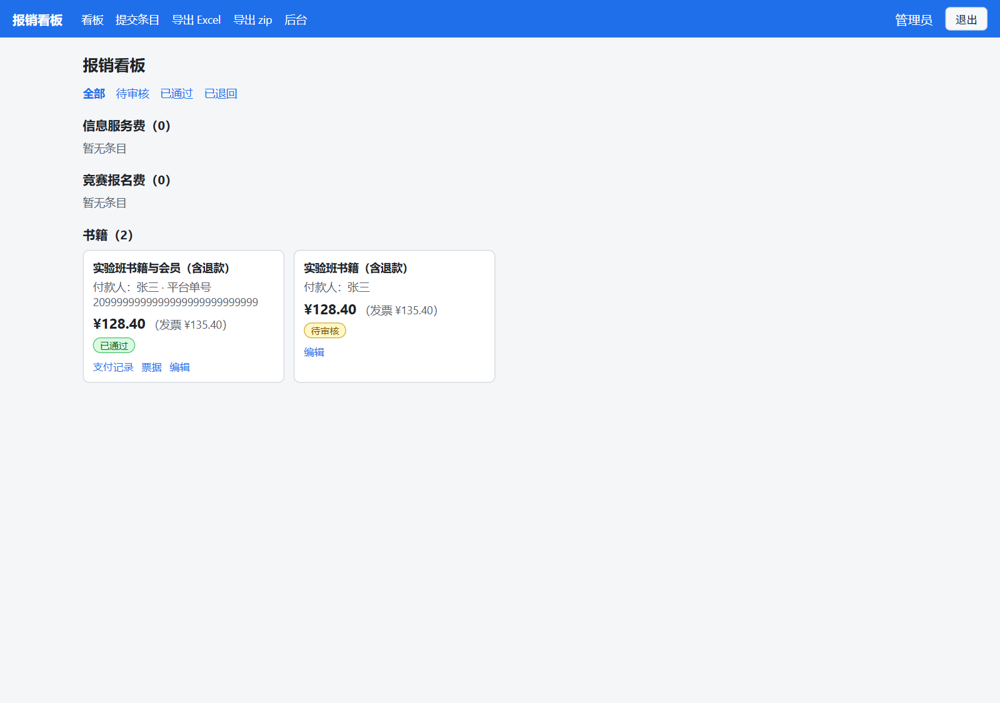
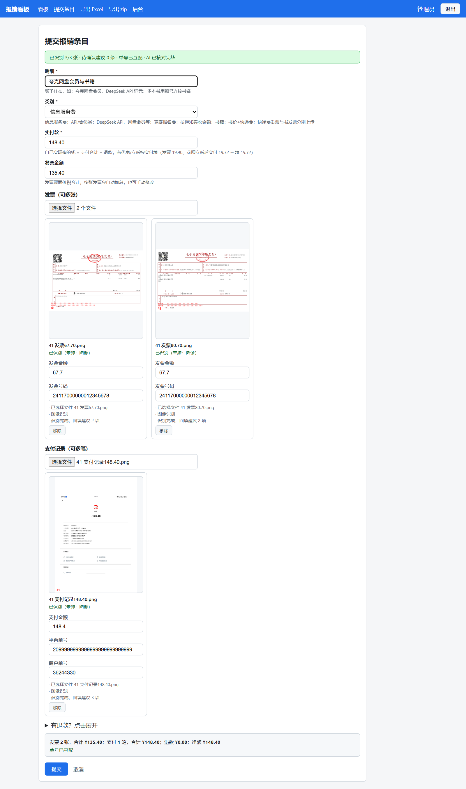

# 报销看板（invoice-manager）


学生登录后自助提交报销条目（发票/支付记录/退款记录附件，AI 识别回填金额与单号，页内预览核对 + 实付金额），按类别看板展示；管理员在后台审核，一键导出报销 Excel 与票据 zip。账号仅由管理员开通，开放注册已关闭。

## 界面预览





## 快速开始

```bash
uv venv --python 3.12
uv pip install -r requirements.txt
uv run python manage.py migrate
uv run python manage.py runserver   # http://127.0.0.1:8000/
```

## 配置

全环境变量驱动，均可缺省（完整清单见 `config/settings.py`）：`DEEPSEEK_API_KEY` 为空时 AI 识别整体关闭；`EXPECTED_INVOICE_TITLE` / `EXPECTED_INVOICE_TAX_ID` 非空时启用对应校验。

## 更多

部署、账号约定与工程规范见 [`AGENTS.md`](AGENTS.md)，术语表 [`CONTEXT.md`](CONTEXT.md)，架构决策 [`docs/adr/`](docs/adr/)。

## License

[MIT](LICENSE)
